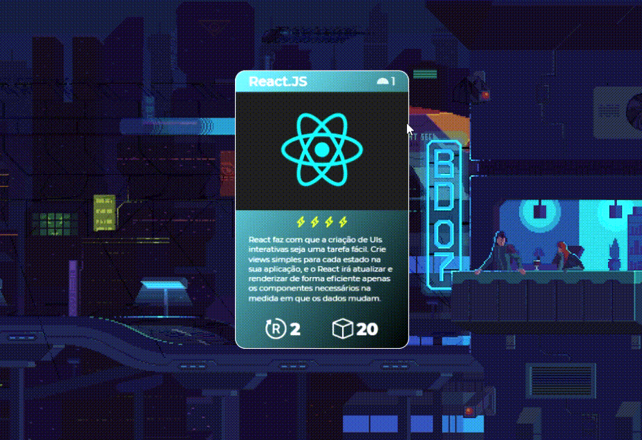

# Tech NFT Card Game
 

  
 
### 🎛️ Dependencies
 
- [Bootstrap Icons](https://icons.getbootstrap.com/)

 
### 🎯 About
This is a prototype from a NFT Card Game about tech World.
  
 
### ⌨️ How it works?

The game's system folows a traditional layout for all the card games rules, but in this NFT CG the battle will start and end in the same turn, simple an fun.

- Head's up
- show your hand
- Win or lose

 
### 🎨 Stylization
Just pure CSS 
 
### 🔧 Next Steps
- Make more cards
- Create a battle ambient
- Create battle ssystem 
- Create a storage data system

 

 
 

